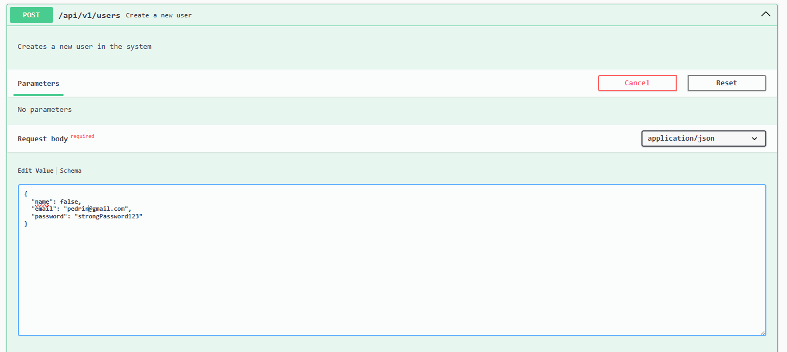
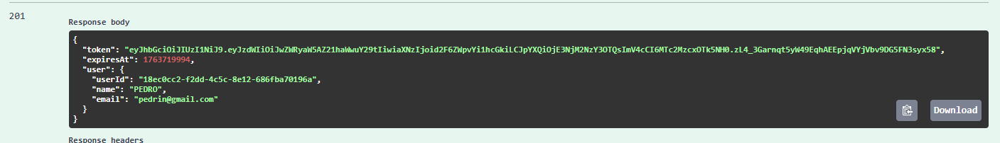
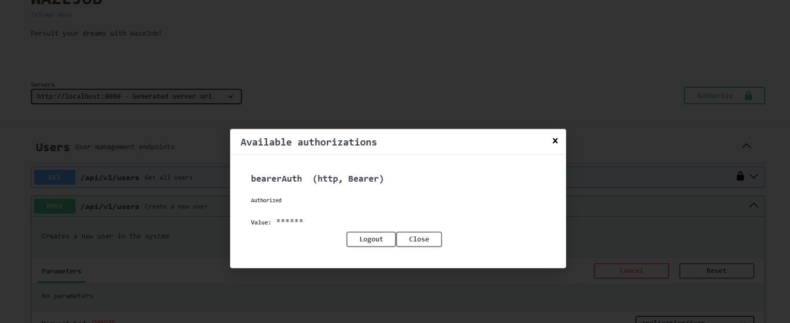

# WazeJobs API

## 1. Descrição do Problema: A Paralisia do Upskilling

No contexto do "Futuro do Trabalho", a rápida evolução tecnológica (IA, automação) exige que os profissionais se requalifiquem (reskilling) e se aperfeiçoem (upskilling) constantemente. No entanto, o maior obstáculo hoje não é a falta de conteúdo educacional, mas o excesso dele.

As plataformas tradicionais de ensino funcionam como "catálogos gigantes", oferecendo milhares de cursos desconexos. Isso gera no profissional a "Paralisia por Análise": sem saber por onde começar ou qual a ordem correta para atingir um objetivo de carreira específico, o usuário sente-se sobrecarregado e ansioso, o que frequentemente leva à inércia e à desistência do aprendizado contínuo.

## 2. A Solução Proposta: WazeJobs

O WazeJobs é uma plataforma que substitui o modelo de "catálogo" por um "GPS de Carreira". Utilizando Inteligência Artificial, a solução oferece:

- **Trilhas Geradas por IA:** Ao invés de buscar cursos manualmente, o usuário define um objetivo (ex: "Migrar de Java para .NET") e a IA gera instantaneamente uma trilha de aprendizado linear e personalizada, contendo apenas os módulos (checkpoints) e passos (steps) necessários para ir do ponto A ao ponto B.

- **Adaptação Dinâmica (Forking):** Entendendo que carreiras não são estáticas, a plataforma permite que o usuário "bifurque" (fork) trilhas existentes, adaptando-as para novos objetivos sem perder o histórico de progresso original.

- **Foco na Ação:** A interface e o modelo de dados priorizam a clareza, apresentando ao usuário o próximo passo imediato, eliminando a ansiedade da escolha e promovendo uma educação contínua mais assertiva e alinhada às demandas de 2030+.

## 3. Informações Técnicas

### Versões
- **Java:** 21
- **Spring Boot:** 3.5.7

### Principais Dependências
- **Spring Boot Starter Web:** Para criar APIs REST.
- **Spring Boot Starter Data JPA:** Para persistência de dados com o banco.
- **Spring Boot Starter Security:** Para segurança da aplicação com JWT.
- **Spring Boot Starter Validation:** Para validação de dados (Bean Validation).
- **Oracle JDBC Driver (ojdbc11):** Driver para conexão com o banco de dados Oracle.
- **Lombok:** Para reduzir código boilerplate (getters, setters, construtores).
- **Springdoc OpenAPI (Swagger):** Para documentação interativa da API.
- **jjwt:** Para criação e validação de JSON Web Tokens (JWT).

## 4. Como Executar o Projeto

### Pré-requisitos
- JDK 21 ou superior instalado.
- Maven instalado.

### Passo a Passo

**1. Instalar Dependências**

Clone o repositório e execute o seguinte comando na raiz do projeto para baixar as dependências do Maven:

```bash
mvn clean install
```
Ou, se estiver usando o Maven Wrapper:
```bash
./mvnw clean install
```

**2. Configurar o Banco de Dados**

O projeto está configurado para se conectar ao meu banco de dados Oracle. As credenciais e a URL de conexão podem ser ajustadas no arquivo `src/main/resources/application.properties`:

```properties
spring.datasource.url=jdbc:oracle:thin:@oracle.fiap.com.br:1521:ORCL
spring.datasource.username=SEU_USUARIO
spring.datasource.password=SUA_SENHA
spring.jpa.hibernate.ddl-auto=create
```

**3. Executar a Aplicação**

Após configurar o banco, execute a aplicação com o seguinte comando:

```bash
mvn spring-boot:run
```
Ou, com o Maven Wrapper:
```bash
./mvnw spring-boot:run
```

A API estará disponível em `http://localhost:8080`.

## 5. Documentação e Testes da API

### Swagger UI
A documentação completa e interativa dos endpoints está disponível via Swagger UI. Via Swagger é possível testar diretamente requisições, porém é um pouco limitado em questão estética.

Após iniciar a aplicação, acesse:

[http://localhost:8080/swagger-ui.html](http://localhost:8080/swagger-ui.html)

### Redoc
Uma alternativa ao Swagger UI é o Redoc, que oferece uma interface mais amigável e organizada para visualizar a documentação da API. 

Após iniciar a aplicação, acesse:

[http://localhost:8080/redoc](http://localhost:8080/redoc)

### Postman
Uma outra opção para testar a API (embora para caso de validação rápida o Swagger seja suficiente).

Após iniciar a aplicação, acesse:

[Postman Collection](https://.postman.co/workspace/My-Workspace~cb34909a-eb5d-447f-88bb-13434a554ae5/collection/38226085-667ac661-d38b-49db-af21-940912c9395d?action=share&creator=38226085)

### Exemplos de Requisições
Podem ser encontrados no Redoc ou POSTMAN e Swagger UI, onde você pode testar diretamente os endpoints da API.

Guia rápido;

1. Primeiro crie seu usuário via endpoint POST /users.


2. Recupere o token JWT retornado na resposta.


3. Coloque-o no "Authorize" do Swagger (Canto superior direito).


4. Após isso, você poderá acessar os demais endpoints protegidos da API.
